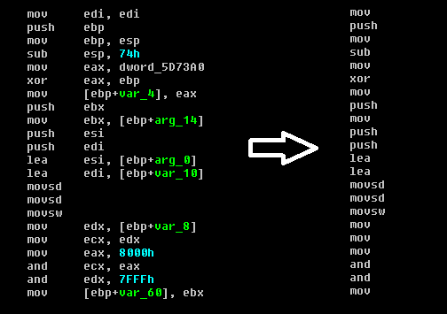
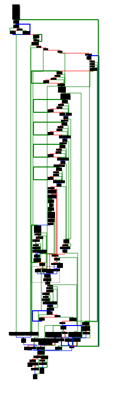
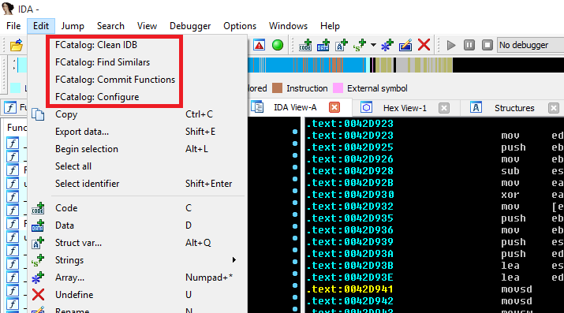
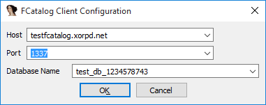

# [FCatalog](https://www.xorpd.net/pages/fcatalog.html)

FCatalog (The functions catalog) is a mechanism for finding similarities between different binary blobs in an efficient manner. It is mostly useful for identifying a new binary blob is somewhat similar to a binary blob that have been encountered before.

The client side of FCatalog is an IDA plugin that allows a group of reverse engineers to manage a pool of reversed functions. Whenever a new binary function is encountered, FCatalog can compare it to all the known and previously reversed binary functions.

If you are a reverse engineer, FCatalog can help you find function that are similar to functions your team have already reversed and named. Never reverse the same function again!

FCatalog is made of two parts: A server and a client. The client can be used as an IDA plugin, or as a python module.

You can find the server and the client on github. There is even a dockerized version of the server if you are more of a docker person.

You can use the test FCatalog server at **testfcatalog.xorpd.net:1337** if you just want to try the FCatalog client with IDA. Note that the test database will be deleted every once in a while.

## Tech stack

- The FCatalog server runs on linux (Tested on Ubuntu >= 14.04). It is written in python3 with Asyncio for networking (Requires python >= 3.4), and uses sqlite3 for persistency.

- The FCatalog client is written in python2.7, and runs as an IDA plugin. I tested it on IDA 6.6 It might work on some other versions.

## Introduction

The binary function is, in many cases, the atomic execution part of a modern computer program. Most modern tools for reverse engineering divide the code into different functions. Reverse engineers can then divide their job of understanding the big program into smaller chunks: Understanding the operation of each function.

Naming functions is a key factor for understanding big programs.

It happens often that the same function shows up a few times in the same binary, or shows up in a few different binaries, maybe of the same product in different versions. Good reversers can usually notice when they spot the same function twice. However, this could get tedious for large databases of code. In addition, when working as a team, two reversers might reverse the same function twice, or reverse two very similar functions.

FCatalog was written to make sure no function is reversed twice. It also allows to gain insights about a new function from similar functions that were already reversed and named.

FCatalog allows you to keep a database of all your named functions, and find similarities from this database efficiently. 

## Methods of calculating similarity

Much has been said about finding the similarity between different binary functions. I will begin with the main requirements from such a similarity scheme:

- Speed: One should be able to calculate the similarity between two binary functions quickly, because for every function we want to search for similarity in large databases of already named functions.

- Overcome small changes: Should be able to identify similarity even when some small changes happen, like changes of some bytes, or chunks of bytes that have moved.

- Portable: Should work for many processors and architectures.

I will describe here the main methods I have noticed. Finally I will explain the algorithm used for FCatalog.

- Edit distance: One can calculate the edit distance between two different binary functions (Treating the two functions as binary blobs) in order to calculate the similarity between them. This similarity score works pretty well, however it is a bit slow to calculate, and requires keeping the binary of all the functions inside the database.

- Stripping operands from instructions: It is possible to use the IDA analysis of the function and read the instructions as text, without taking their operands. Finally, take some cryptographic hash, like sha256 on the text of all the instructions in the function. This method has the disadvantage of being not very sensitive to changes in the function.



- Analyzing the function graph: IDA knowns how to generate a graph view for each function. This graph is generated by considering the various branches inside the function. It is possible to keep the graph of the function, and then trying to somehow compare it to graphs of other functions. I have never tried this myself, but I think that many not so large functions might have the same graph structure.



## The Catalog1 similarity algorithm

The Catalog1 similarity algorithm is an algorithm for comparing two arbitrary binary blobs (Not necessarily binary functions). For every binary blob of size n it can generate a constant size signature in O(n) operations. To compare two blobs, one has to compare their two constant size signatures. The amount of matching parts of the two signatures will be the similarity grade for the two binary blobs.

As the signature is of constant size, it is easy to save all the signatures inside the database, instead of the binary of the functions themselves. In addition, after doing the one time work of calculating functions signatures, it is possible to calculate the similarity between two functions in O(1) operations, by comparing their constant size precalculated signatures.

### The basic idea behind catalog1

Let $a$ and $b$ be two binary blobs. By binary blobs we mean a string of bytes. we denote by $S(a)$ to be the set of all consecutive 4 bytes from $a$. For example, if $a=123xy1$ then $S(a)=\{123x,23xy,3xy1\}$. If, on the other hand, $a=11111$ then $S(a)={1111}$, because sets can contain every element only once.

Basically, for two binary blobs a,b, the Catalog1 algorithm calculates an approximation for $\frac {S(a) \cap S(b)}{S(a) \cup S(b)}$, which is the Jaccard similarity coefficient of the two sets $S(a)$, $S(b)$.

Some thoughts about the meaning of this formula:

- Catalog1 algorithm assumes that the set S(a) encapsulates enough information to almost reconstruct the binary blob a. This is not true in all cases, but we assume that it works in most practical cases.

- The Jaccard index of two sets says something about how similar those two sets are. It is a number between 0 and 1. If the sets have zero intersection, it will be 0. If the two sets are exactly the same, it will be 1. We use the Jaccard index to find out how similar are the two sets $S(a)$ and $S(b)$. Hopefuly this should tell us how similar are the two binary blobs a and $b$.

### Acheiving constant size signature

We promised above a constant sized signature for each binary blob $a$, however the set $S(a)$ is not constant sized. We want a way to compress the information inside $S(a)$ into $a$ constant sized construct. Of course this is not possible because of information considerations. That said, we could get an approximation.

The MinHash allows to create such a signature. The MinHash method allows to encode a set into a constant sized signature. Using the resulting signatures one can approximate the Jaccard Index of two sets.

It works as follows: We assume a world $X$ of possible set elements. (In our case above the set of elements of the world are all the possible combinations of consecutive 4 bytes). We also assume the existence of $k$ random hashes $h_1, ..., h_k$, where $hi: X \to [0,1]$.

Now assume that we are given some set $ T \subseteq X $. ($T$ could be a set of the form $S(a)$ for some binary blob a, for example). We want to create a constant sized signature for this set. We do it as follows. For each $1 ≤ i ≤ k$ we calculate $ sig_i(T) := min_{t \in T} h_i(t)$. Finally we get $sig(T) :=(sig_1(T),⋯,sig_k(T))$, which is a constant size signature.

For two sets $A, B$ we can approximate the Jaccard Index $J(A,B):=A∩BA∪B$ by counting the amount of matching entries between $sig(A), sig(B)$ and dividing by $k$. This will work because it turns out, $Pr[sigi(A)=sigi(B)]=J(A,B)$.

Generally, if we pick bigger k we can get a better approximation of the Jaccard Index $J(A,B)$, but the signatures will get bigger and harder to calculate.

Back to our world of binary blobs: If we are given a binary blob a, we first calculate the set $S(a)$, and then we calculate $sign(S(a))$ to get a constant sized signature.

In other words, we need $k$ random hash functions from the world of 4 consecutive bytes into [0,1]. For each of those random hash function we calculate the minimum value over all the possible consecutive 4 bytes in the binary blob $a$. We collect all those minimums, and we form a constant sized signature of size $k$.

### Getting random hashes

Where do we get the random hashes from? More specifically, we mentioned above random hashes from the world of 4 consecutive bytes (We can also call these kind of elements DWORDS) into [0,1]. The set [0,1] is somewhat impractical to program, so we can change it to be the same set of the domain: All possible 4 consecutive bytes.

If we defind $DWORD=\{0, 1, ..., 2^{32}−1 \}$, then our random hash functions should be functions of the form $h: DWORD \to DWORD$. To make sure we don't "waste information", we can pick permutations as a special case of hash functions.

But where can we get k random permutations from DWORD to DWORD? We can invent them ourselves. We just want to make sure that they will be pretty different from each other, and that they will be easy to calculate.

We could pick, for example, that $h_i(x)$ would be the last 4 bytes of sha256 of the string $str(i) + "||" + str(x)$ (Where + is concatanation), but that would be somewhat slow to calculate, and it will not give us permutations.

Generally one can generate pretty random permutations by moving numbers through random tables, adding, xoring and rotating numbers. Doing a few of those tricks one can get this kind of result:

```python
WORD_SIZE = 32      # 32 bits.
MAX_WORD = (1 << WORD_SIZE) - 1
BYTE_SIZE = 8       # 8 bits.

# An array of random dwords.
RAND_DWORDS = [1445200656, 3877429363, 1060188777, 4260769784, 1438562000,
    2836098482, 1986405151, 4230168452, 380326093, 2859127666, 1134102609,
    788546250, 3705417527, 1779868252, 1958737986, 4046915967, 1614805928,
    4160312724, 3682325739, 534901034, 2287240917, 2677201636, 71025852,
    1171752314, 47956297, 2265969327, 2865804126, 1364027301, 2267528752,
    1998395705, 576397983, 636085149, 3876141063, 1131266725, 3949079092,
    1674557074, 2566739348, 3782985982, 2164386649, 550438955, 2491039847,
    2409394861, 3757073140, 3509849961, 3972853470, 1377009785, 2164834118,
    820549672, 2867309379, 1454756115, 94270429, 2974978638, 2915205038,
    1887247447, 3641720023, 4292314015, 702694146, 1808155309, 95993403,
    1529688311, 2883286160, 1410658736, 3225014055, 1903093988, 2049895643,
    476880516, 3241604078, 3709326844, 2531992854, 265580822, 2920230147,
    4294230868, 408106067, 3683123785, 1782150222, 3876124798, 3400886112,
    1837386661, 664033147, 3948403539, 3572529266, 4084780068, 691101764,
    1191456665, 3559651142, 709364116, 3999544719, 189208547, 3851247656,
    69124994, 1685591380, 1312437435, 2316872331, 1466758250, 1979107610,
    2611873442, 80372344, 1251839752, 2716578101, 176193185, 2142192370,
    1179562050, 1290470544, 1957198791, 1435943450, 2989992875, 3703466909,
    1302678442, 3343948619, 3762772165, 1438266632, 1761719790, 3668101852,
    1283600006, 671544087, 1665876818, 3645433092, 3760380605, 3802664867,
    1635015896, 1060356828, 1666255066, 2953295653, 2827859377, 386702151,
    3372348076, 4248620909, 2259505262]


def ror(x,i):
    """
    Rotate right x by i locations.
    x is a dword
    """
    return ((x >> i) | (x << (WORD_SIZE - i))) & MAX_WORD

NUM_ITERS = 4
def perm(num,x):
    """
    A permutation from dwords to dwords.
    num is the number of permutation (This could generate many different
    permutation functions)
    x is the input dword.
    """
    for i in range(NUM_ITERS):
        x += RAND_DWORDS[(i + num + x) % len(RAND_DWORDS)]
        x &= MAX_WORD
        ror_index = (x ^ RAND_DWORDS[(i + num + 1) % len(RAND_DWORDS)]) % WORD_SIZE
        x = ror(x,ror_index)
        x ^= RAND_DWORDS[(i + num + x) % len(RAND_DWORDS)]
        ror_index = (x ^ RAND_DWORDS[(i + num + 1) % len(RAND_DWORDS)]) % WORD_SIZE
        x = ror(x,ror_index)
        assert (x <= MAX_WORD) and (x >= 0)
    return x
```

To get $h_i(x)$, we invoke $perm(i,x)$.

### Signature code

Finally, to get the signature of a binary blob we have the following code:

```python
def bytes_to_num(data):
    """
    Convert a string to a number
    """
    return int.from_bytes(bytes=data,byteorder='big')


def slow_sign(data,num_perms):
    """
    Sign over data.
    Use num_perms permutations. (The more you have, the more sensitive is the
    comparison later).
    """
    nbytes = WORD_SIZE // BYTE_SIZE
    if len(data) < nbytes:
        raise Catalog1Error('data must be at least of size {} bytes.'.format(nbytes))

    res_sign = []

    for p in range(num_perms):
        num_iters = len(data) - nbytes + 1
        cur_sign = min([perm(p,bytes_to_num(data[i:i+nbytes])) for i in range(num_iters)])
        res_sign.append(cur_sign)

    return res_sign
```
This code calculates the minimum for every permutation function over every 4 consecutive bytes of the binary blob. Note that this code was written in python3 (So be careful with strings and bytes). If you want to try it, you can find it here.

The signing function is called slow_sign for a reason. It is a bit slow when implemented in python. The FCatalog server uses a compiled C version of this function, which runs much faster. It is still an open question for me if this kind of function could be possibly implemented efficiently using pure python.

### The FCatalog Database

The FCatalog database is implemented as an sqlite3 database (Using the python bindings). Choosing sqlite3 was mostly due to ease of use. Postgresql might have given me better performance, but I came to the conclusion that most of my reverse engineer friends are not fans of complicated technology, and will prefer a database that fits in a file every day.

Indeed, the major advantage of this storage method is that one can just copy the database files and put them somewhere else, without any specific knowledge of how they work, and what is inside. It is also much easier to install the server, as it has less dependencies.

Each database is kept in its own sqlite file. Each such database has a unique name, and it contains one table of functions. Every row contains the name of the function, the head comment of that function and the Catalog1 signature of that function. It also contains a sha256 hash of the function's binary. The function binary is not kept inside the database.

Whenever the user wants to query for a local function, he sends a binary blob representing the function to the server. The server then calculates the Catalog1 signature of that function, and looks for this signature inside the database.

Searching for a signature inside the database is done by searching for each entry of the signature first (In my implementation there are 16 permutations, so 16 entries), then a UNIQUE UNION over all the results, and finally a more specific search for the best signature match. It seems to work fast enough. I still wonder if there is a faster way to do it, in the form of a smarter algorithm. (That hopefully will behave nicely with sqlite).

## Using FCatalog

### Installation notes

You will need IDA >= 6 with IDAPython to enjoy the fcatalog_client, so install it first. Next, install the fcatalog_client as a plugin for IDA. See here the installation instructions.

Note that the plugin is written for python2.7, which is the current python version used for IDAPython.

You will also need a server. To try FCatalog you can use the test server at testfcatalog.xorpd.net:1337. If you want your own server, check out the server installation instructions.

### Basic workflow

When you open some file in IDA you will notice that you have new items in the EDIT menu:




- Clean IDB: Clean your database from any changes made to function names by FCatalog.

- Find Similars: Find functions from the remote FCatalog database that might be similar to functions on your IDB.

- Commit Functions: Commit all your named functions to the remote FCatalog database.

- Configure: Configure FCatalog Client.

You will usually begin by configuring FCatalog client.



The configuration window contains the hostname of the remote server and the TCP port used for connection. If you use the test server, you should put in testfcatalog.xorpd.net as hostname, and 1337 as port.

Next, you have to fill in a database name. You can pick any name that you want. If the database does not exist, the server will create it. If you have access to the FCatalog server, you will be able to view all the created databases in the linux path /var/lib/fcatalog.

When you click OK the configuration will be applied and saved inside the IDB. (Currently it is saved in hackish way as the first comment on the first line. If you know of a nicer way, please tell me about it).

Having a working configuration is required for running "Find Similars" and "Commit Functions" operations.

### Commiting and Finding similar Functions

You are working on some reversing project and you managed to understand what some functions do. You also managed to find a good name to each of those functions. Good! Now you can share those functions with the rest of your team. This can be done using the "Commit Functions" button. Click on this button.

All your properly named functions (that are also large enough) will be uploaded to the FCatalog server's database.

As the "Commit Functions" operation can take a while, it is executed in the background. Be patient, you can see information about progress at IDA's output window.

After a while you open a new IDB for a similar project. Maybe it's a new version of the same product, or just another binary file of the same processor type. It's time to use your FCatalog database. Click on the "Find Similars" button.

You will now be asked for a similarity grade cut. This means: How many entries of the signatures should be equal between two functions for us to consider those functions to be similar. The current implementation of Catalog1 in FCatalog uses 16 permutations. A reasonable similarity grade cut would be 9. You can use smaller values if you want more results. If you pick 1, for example, you will get a lot of results, but most of them will be not very accurate. If you pick 16, you will only get almost exact matches.

Every function in your IDB that has a similar match in the FCatalog database will be given a special name. The name will be of the form:

```
FCATALOG __ <similarity_grade> __ <Matched Function Name> __ <address>
```

Similarity grade is a number between 0 and 16 (This is the amount of matching entries between the two functions: The function from the IDB and the remote function found on the FCatalog database).

Matched Function name is the name of the function found at the remote FCatalog database. This should give you a hint about what your local function is. It might not always be a good match, but in many cases it will give you a good clue.

Address is the address of your local function. This is added for uniqueness of the name, because more than one of your local functions could be similar to the same remote function from the FCatalog database.

Some examples of FCatalog style function names:

```
FCATALOG__12___atoldbl_l__0042D16A
FCATALOG__14__write_to_nvram__005139C2
```

The FCATALOG prefix and the following grade can help you sort the functions in the functions window, and spot important matches.

Running "Find Similars" will not override your own named functions. It can only set names for unnamed functions, or functions that have an FCATALOG style name.

As you continue working on your reversing project, you should click "Commit Functions" from time to time after you name a few interesting new functions, and click "Find Similars" after other reversers on your team tell you they have added some new functions to the database.
FCatalog Databases management

You should use different databases for binaries of different architectures. For example, you don't want to find x86 functions that look like PowerPC functions. That would be meaningless.

A good practice would be to add the architecture as a prefix to the database name. For example: x86_SomeProgram or arm_SomePhoneApp.

Databases can not be deleted from the client side. In addition, currently there is no option of viewing all the databases on the server from the client side. If you own the server, you can look at /var/lib/fcatalog to see all the databases. If you want to delete a file, make sure to stop the FCatalog server first.